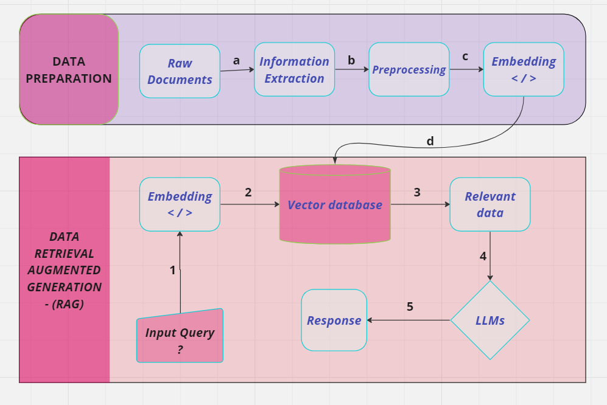

# **PDF Chatbot with Llama7B Model:**


Welcome to the PDF Chatbot powered by the Llama7B model! This chatbot is designed to take PDF documents as input and answer questions related to the content of those documents. 


## **Pipeline:**


## **To try this :-**

### **1. Clone the Repo**
```bash
$ git clone https://github.com/Venkatesan03/LLama7B_Pdfbot.git
```
1. Download the LLama model in your local machine.


2. Navigate to the chatbot.py file and provide the location to the Llama model that you downloaded in the chatbot.py file.

### **2. Install prerequisite libraries using requirement.txt file**
Create a virtual Environment and activate it. Then 
```bash
$ pip3 install -r requirements.txt
```
### **3. Run the code**
```bash
$ uvicorn app:app --reload
```
The /upload_pdf and /ask_question API endpoints are used to upload files and generate replies, respectively.

## **Thanks for the visit.😃**